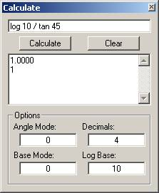



## Calculate

### Description

This code is the primary module of Calculation Solver, a compiler-based string evaluation program. This module can be called in one simple line which evaluates and returns the result. Feel free to use it in your programs (just remember to give credit where credit is due). Full syntax description and sample program is included as well.
 
### More Info
 

             |
---                |---
**Submitted On**   |2001-03-04 12:36:24
**By**             |[Anton Venema](https://github.com/Planet-Source-Code/PSCIndex/blob/master/ByAuthor/anton-venema.md)
**Level**          |Advanced
**User Rating**    |5.0 (15 globes from 3 users)
**Compatibility**  |VB 6\.0
**Category**       |[Miscellaneous](https://github.com/Planet-Source-Code/PSCIndex/blob/master/ByCategory/miscellaneous__1-1.md)
**World**          |[Visual Basic](https://github.com/Planet-Source-Code/PSCIndex/blob/master/ByWorld/visual-basic.md)
**Archive File**   |[CODE\_UPLOAD15905342001\.zip](https://github.com/Planet-Source-Code/anton-venema-calculate__1-21508/archive/master.zip)

